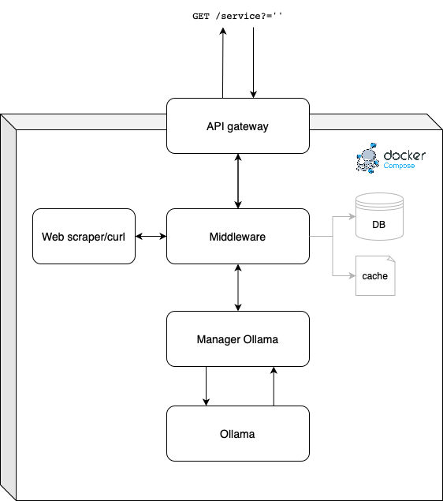

# Architecture


# API endpoints e pipeline

### 1. GET …:5000/api/v1/get-specs?name={…}

Il Gateway inoltra la richiesta al middleware

### 2. GET web_scraper/payload

il Web scraper risponde con l’HTML SENZA TAG nel body come response.

### 3. GET manager_ollama/payload

Il manager ollama prende l’HTML→ lo filtra→ lo passa ad ollama e risponde con il json.

### 4. GET ollama:11334/…

Ottiene la risposta del modello, verrà utilizzata nella response per il Middleware

### 5. Salvataggio su DB

Prima fase: semplice file txt → solo il json

### 6. Passaggio della risposta 2 al gateway


# Elemento coding conventions

Use this repo as template for new and existing repos

# Conventions

In Elemento we use [Google Style coding conventions](https://google.github.io/styleguide/).

## Examples

### Environment variables

`ELEMENTO_ENVIRONMENT_VARIABLE`

### Git repositories

`elemento-function-{client,server}`

### Python
Use flake8 and autopep8 to refactor your code.

```python
class ElementoClass():
    def __init__():
        self.dataMember = None
    
    def get_function():
        pass

```
